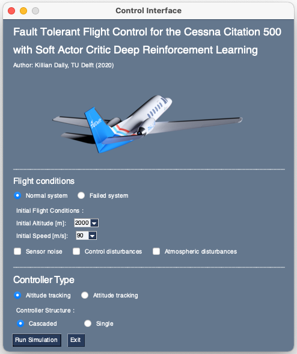

<h1 align="center">DRL for Flight Control </h1>
<p>
  
  <a href="#" target="_blank">
   
    <a href="#" target="_blank">
    
  </a>
</p>


Fault-tolerant flight control for the Cessna Citation 500. First use of Deep Reinforcement Learning for a jet aircraft flight controller. The code was developed for an MSc thesis entitled [Deep Reinforcement Learning for Flight Control](http://resolver.tudelft.nl/uuid:fcef2325-4c90-4276-8bfc-1e230724c68a).

<p align="center">
  
</p>

## Installation
> MacOS users can use the module straight away.
> Linux and Windows users are required to recompile the CitAST high-fidelity simulation model as instructed in `docs/CitAST_for_Python.pdf`.

1. Clone fault-tolerant-flight-control-drl
```sh
cd <installation_path_of_your_choice>
git clone https://github.com/kdally/fault-tolerant-flight-control-drl
cd fault-tolerant-flight-control-drl
```

2. Create a new conda environment with the required packages

```sh
conda env create -f environment.yml
conda activate ftc-drl
python setup.py install
```

## Usage

1. To fly the aircraft right away with pre-trained agents 🛩
```sh
python tests/test_all.py
```

> Select flight settings on the GUI. Default choices are recommended for unexperienced users.

<p align="center">
  
</p>


2. To retrain the inner-loop and outer-loop controllers ⚙️
```sh
python tests/train_inner_loop.py
python tests/train_outer_loop.py
```

3. To perform a hyperparameter optimization 🎯
```sh
python tests/optimization.py
```


## Author

👤 **K. Dally**
(Delft University of Technology MSc. Student)
* Github: [@kdally](https://github.com/kdally)
* LinkedIn: [@kdally](https://linkedin.com/in/kdally)

> Project developed as part of a [Master's Thesis](http://resolver.tudelft.nl/uuid:fcef2325-4c90-4276-8bfc-1e230724c68a) at the Control & Simulation Department, Faculty of Aerospace Engineering at Delft University of Technology.

## References

* Haarnoja, T., Zhou, A., Abbeel, P., and Levine, S. (2018) [[paper](https://arxiv.org/abs/1801.01290)][[code](https://github.com/haarnoja/sac/tree/master/sac)]
* Haarnoja, T., Zhou, A., Abbeel, P., and Hartikainen, K. (2019) [[paper](https://arxiv.org/abs/1812.05905)][[code](https://github.com/rail-berkeley/softlearning/)]
* Hill, A. et al. (2018) [[doc](https://stable-baselines.readthedocs.io/)][[code](https://github.com/hill-a/stable-baselines)]
* Rodríguez, R. (2021) [[article](https://medium.com/codestory/3d-animations-made-simple-with-matlab-visualizing-flight-test-data-and-simulation-results-ed399cdcc711)][[code](https://github.com/Ro3code/aircraft_3d_animation)]


***
